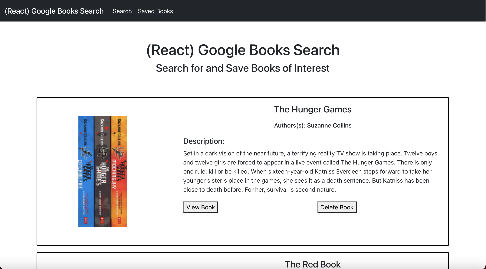
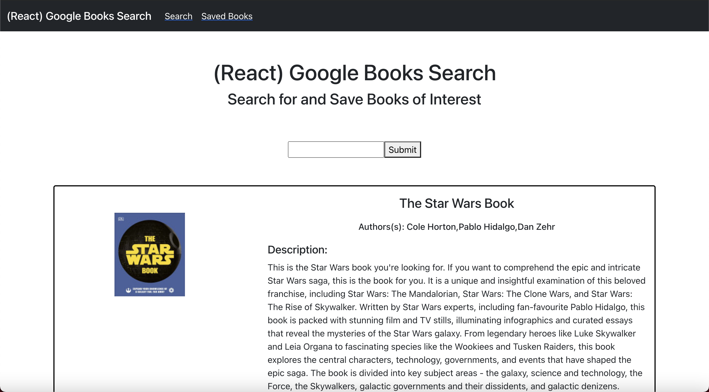

# React Google Books Search  
  ## Table of Content
  * [Description](##Description)
  * [Installation Instructions](##Installation-Instructions)
  * [Usage Instructions](##Usage-Information)
  * [Contribution Guidelines](##Contribution-Guidelines)
  * [Test Instructions](##Test-Instructions)
  * [Questions](##Questions)
  
## Screenshots

  ## Description
  This is a MERN stack application that includes 2 pages.  The first page is a list of saved books in the database, where the user can either view the books on Google Books or delete the books from the database.  The second page is a search page, where the user can search for books using the Google Books API.  The user can view the book on Google Books or save them to the database. 

  ## Installation Instructions
  This application is deployed on Heroku. 

  ## Usage Information
  Click the link here. 

  ## Contribution Guidelines
  This project adheres to  for any contributions.

  ## Test Instructions
  Type in any type of name in the search bar of the Search page to start searching for books.  Then add the book into the database.  Go to the Saved page to confirm that the book is saved in the database. 

  ## License
  This project and the application(s) hereinto is(are) covered under the MIT License.  
  
  ## Questions
  For any questions about this project, please first visit my Github repo [here](https://github.com/alzcheng). 
  If the answers are not found in my repo, you can email me directly at <albertzcheng@gmail.com>.
